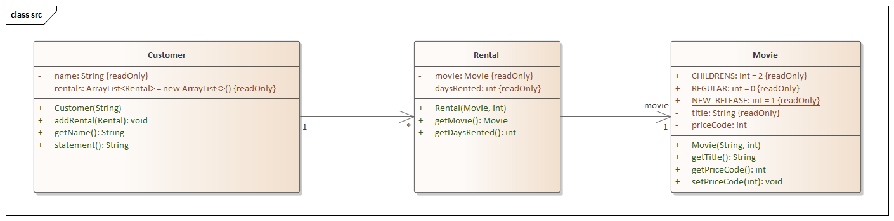

# Refactoring

 Teaching Refactoring with Martin Fowler

## The video store example

 Das Beispielprogramm ist einfach und inzwischen etwas nutzlos. Videotheken gibt es nicht mehr und
 Verwaltungsprogramme dafür sind also obsolet. Dennoch möchten wir dieses klassische Beispiel aus
 dem Buch *Refactoring*<sup id="fn_1">[1](#footnote_1)</sup>. von Martin Fowler, das bereits im Jahr 2000 erschienen ist hernehmen,
 um die Grundideen des Refactoring zu veranschaulichen.

 Das Programm soll Rechnungen für Kunden einer Videothek erstellen und ausdrucken bzw. auf dem Bildschirm 
 darstellen. Es ermittelt hierzu, welche Filme der Kunde wie lange ausgeliehen hat und berechnet daraus die 
 Leihgebühr. Dabei gibt es drei Arten von Filmen: Normale Filme (REGULAR), Kinderfilme (CHILDREN) und Neuerscheinungen. (NEW_RELEASE).
  
 Weiterhin zeigt das Programm Bonuspunkte (FrequentRenterPoints) an. Für jeden Film, den man ausleiht, erhält der 
 Kunde einen Bonuspunkt - leiht er Neuerscheinungen aus, erhält er sogar zwei.

 Die Elemente der Videothek werden durch drei Klassen repräsentiert.

  

 **Movie** ist nur eine einfache Datenklasse.

 **Rental** repräsentiert eine Ausleihe eines Films durch einen Kunden.

 **Customer** repräsentiert einen Kunden der Videothek. Diese Klasse hat neben den Zugriffsmethoden auch eine Methode 
 `statement()`, die eine Rechnung auf dem Bildschirm ausgibt.

**Was halten Sie von dem Design dieses Programms?**

 Ich würde es nicht als besonders gelungen bezeichnen. Für ein einfaches Programm wie dieses machts das natürlich nichts. Es ist nichts gegen ein "Quick-and-Dirty-Programm" einzuwenden, solange es so einfach ist. Wäre der Code jedoch Teil eines komplexeren Systems, das regelmäßig erweitert werden muss, so hätte ich ein echtes Problem mit dem Programm.

 Obwohl ja das Programm irgendwie funktioniert ist der hässliche Code nicht nur ein ästhetisches Problem.
 Spätestens dann, wenn wir den Code ändern müssen, um z.B. eine andere Preisberechnung oder eine anderes
 Ausgabeformat für die Rechnung zu realisieren oder gar ein neues Bonusmodell oder weitere Produktkategorien
 hinzufügen sollen, macht es keinen echten Spaß mehr.

 Deshalb sollten wir zuerst ein sog. Refactoring durchführen. Hierbei ändern wir den Code um das Design des Programms zu verbessern, ohne die Funktionalität zu verändern.

 Martin Fowler gibt hier foglenden Merksatz:  

 > "When you have to add a feature to a program but the code is not structured in a convenient way, first refactor the program to make it easy to add the feature, then add the feature."

Wie geht nun das vonstatten: Refactoring?
Um hier erfolgreich braucht man vor allem eines: Tests, die sichersellen, dass wir wirklich keine unerwünschten Seiteneffekte in unseren Code einbauen. Und hier sieht man schon, Tests sind hier nicht vorhanden. Leider ist das oft so,
und fast genausso oft ist es fast unmöglich, sinnvolle Tests für die zu ändernde Funktionalität zu schreiben. Sehen Sie sich hier die Methode `statement()' an.

```java
public String statement() {
        double totalAmount = 0;
        int frequentRenterPoints = 0;

        String result = "Rental Record for " + getName() + "\n";
        for( Rental curRental : rentals ) {
            double thisAmount = 0;

            // determine amounts for each line
            switch( curRental.getMovie().getPriceCode() ) {
                case Movie.REGULAR:
                    thisAmount += 2;
                    if( curRental.getDaysRented() > 2 )
                        thisAmount += ( curRental.getDaysRented() - 2 ) * 1.5;
                    break;
                case Movie.NEW_RELEASE:
                    thisAmount += curRental.getDaysRented() * 3;
                    break;
                case Movie.CHILDRENS:
                    thisAmount += 1.5;
                    if( curRental.getDaysRented() > 3 )
                        thisAmount += ( curRental.getDaysRented() - 3 ) * 1.5;
                    break;

            }
            totalAmount += thisAmount;

            // add frequent renter points
            frequentRenterPoints++;
            // add bonus for a two day new release rental
            if( ( curRental.getMovie().getPriceCode() == Movie.NEW_RELEASE ) && curRental.getDaysRented() > 1 )
                frequentRenterPoints++;

            // show figures for this rental
            result += "\t" + curRental.getMovie().getTitle() + "\t days rented: " + curRental.getDaysRented() + "  = " +  String.valueOf( thisAmount ) + "\n";

        }
        // add footer lines
        result += "Amount owed is " + String.valueOf( totalAmount ) + "\n";
        result += "You earned " + String.valueOf( frequentRenterPoints ) + " frequent renter points";
        return result;
    }
```

Die Methode gibt einen String zurück. Also können wir hier ein paar Tests schreiben, die überprüfen, wie der zurückgegebene String momentan aussieht.

### Schritt 1: Tests für die Methode statement() hinzufügen

Was sollten wir alles Testen? Sehen sie sich dazu die statement-Methode an. Sie berechnet zum einen die Leihgebühr. Dabei ist die Höhe der Leihgebühr abhängig von:

* der Art des Mediums (regular, children's, new release)

* der Leihdauer

Weiterhin werden Bonuspunkte vergeben - auch hier gibt es einen Sonderfall. Beide Fälle müssen bei den Tests berücksichtigt werden.

Die Tests sollten also sinnvolle und interessante Testfälle dieser Kombinationen enthalten.

**Aufgabe:** Bestimmen Sie welche Kombinationen sinnvoll sind. Welche Tests planen Sie?

 ---
 <b id="footnote_1">(1)</b> Fowler, Martin: Refactoring, Improving the Design of Existing Code. 1999 [↩](#fn_1)